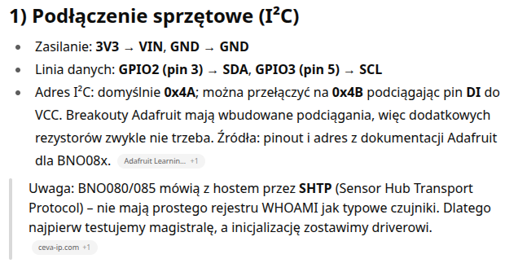
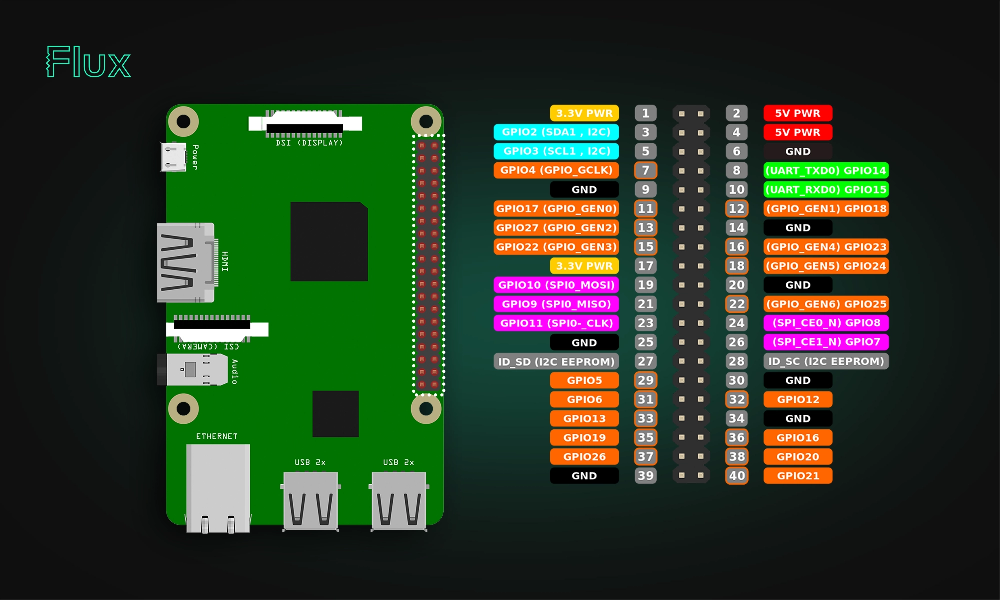

# Dokumentacja projektu IMU Rust

## 1. Wprowadzenie
Ten projekt zbiera dane z czujnika inercyjnego BNO08X podłączonego do Raspberry Pi przez magistralę I²C. Efektem pracy `cargo build --release` jest niewielki binarny program w Rust (`src/main.rs`), który na razie czyta surowe ramki SHTP i wypisuje najważniejsze informacje w konsoli. To wciąż prototyp, ale wystarczająco stabilny, żeby zacząć badać zachowanie sensora i przygotowywać dalsze kroki.

## 2. Sprzęt i wymagania
- Raspberry Pi 3B+ (albo inny model z aktywnym `i2c-1`).
- Moduł z czujnikiem BNO08X/BNO085 pracujący w trybie I²C.
- Zasilanie 3.3 V – linie I²C w tym układzie nie tolerują 5 V.
- W systemie Raspberry trzeba wcześniej włączyć I²C (`raspi-config` → Interface Options → I2C).

### 2.1. Schemat połączeń I²C

> Potrzebujesz ostrzejszego obrazu? Sięgnij po wariant WebP:  
> 

| Raspberry Pi pin | Funkcja | Połączenie na BNO08X |
| ---------------- | ------- | -------------------- |
| 3.3 V (pin 1)    | VCC     | VIN / 3V3            |
| GND (pin 6)      | GND     | GND                  |
| GPIO2 (pin 3)    | I²C SDA | SDA                  |
| GPIO3 (pin 5)    | I²C SCL | SCL                  |
| (opcjonalnie)    | RST     | RESET / nRST         |
| (opcjonalnie)    | PS0/PS1 | GND dla trybu I²C    |

#### Kroki podłączenia
1. Wyłącz Raspberry Pi, zanim zaczniesz cokolwiek wpinać.
2. Podłącz 3.3 V i GND, upewniając się, że przewody są krótkie i dobrze osadzone.
3. Poprowadź linie SDA oraz SCL zgodnie z tabelą; długość przewodów najlepiej utrzymać poniżej 20 cm.
4. W razie potrzeby zewrzyj piny `PS0` i `PS1` do masy, żeby wymusić tryb I²C.
5. Pin RESET warto podłączyć do GPIO tylko wtedy, gdy planujesz sterowanie programowe.
6. Po włączeniu Raspberry sprawdź, czy czujnik odpowiada: `i2cdetect -y 1` powinien pokazać adres `0x4a`.

## 3. Konfiguracja oprogramowania
1. Zainstaluj Rust i Cargo przy pomocy `rustup`.
2. W katalogu repozytorium uruchom `cargo build --release`, żeby dostać gotowy binarny plik.
3. Do szybkiego testu spróbuj `cargo run --release`; pamiętaj, że potrzebny jest dostęp do `/dev/i2c-1`.

## 4. Jak działa `src/main.rs`
Program korzysta z `linux-embedded-hal::I2cdev`, dzięki czemu otwiera `/dev/i2c-1` pod adresem `0x4A`. Stała `MAX_FRAME` zabezpiecza bufor odbioru (512 B, żeby nie przepełnić pamięci). Kluczowy element to struktura `ShtpHeader`, która parsuje 4 bajty nagłówka na pola `len`, `channel` i `sequence`. Główna pętla wygląda z grubsza tak:

- najpierw `i2c.read(...)` pobiera nagłówek; interfejs z traitu `embedded_hal::blocking::i2c::Read` umożliwia ewentualne migracje na inną warstwę sprzętową,
- sprawdzamy, czy `len` ma sensowną wartość, a potem liczymy długość payloadu (`len - 4`); przy dziwnych danych leci `anyhow::bail`,
- jeśli jest co czytać, drugi `read` ściąga payload do dynamicznego wektora,
- w logu ląduje nagłówek oraz pierwsze 16 bajtów payloadu zapisane w hexie,
- na końcu `thread::sleep(5 ms)` daje odsapnąć magistrali i CPU.

Całość jest opleciona `anyhow::Context`, więc w logach pojawiają się sensowniejsze błędy (np. „nie mogę otworzyć /dev/i2c-1”), co bardzo pomaga przy diagnozie podłączeń.

## 5. Co dalej?
- Rozszyfrowanie payloadów SHTP w zależności od kanału (rotacja, akcelerometr, itd.).
- Buforowanie danych na dysk albo wypychanie ich w sieć.
- Testy jednostkowe dla parsera nagłówków, żeby złapać regresje.
- Uzupełnienie dokumentacji o diagram przepływu danych i wskazówki dotyczące unitów systemd.
